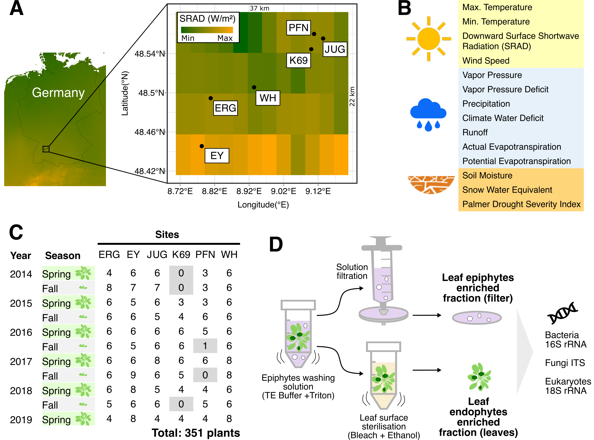

# ModelClimateMicro

This repository includes raw data (OTU tables, taxonomy, sequences of OTUs, and metadata) and all scripts used to generate figures for the manuscript:  
**"Microbial communities living inside plant leaves or on the leaf surface are differently shaped by environmental cues"**

The manuscript is published in [*ISME Communications*](https://doi.org/10.1093/ismeco/ycae103).

Due to file size limitations in github, the complete version of this project, including all datasets, is stored at the following path. If you are interested, you can access it here:
Path: https://gitlab.plantmicrobe.de/maryam_mahmoudi/AbioticAraMicrobe

---

---

## Repository Structure

### Final Figures and Tables
Final figures and plots used in the manuscript can be found in:  
[**Final_FigsAndTables/**](Final_FigsAndTables/)

---

## Sequencing Data Overview

### 1) Whole Genome Sequencing (WGS) Data
Purified genomic DNA from 104 endophytic samples was amplified using REPLI-g Mini Kits, and sequencing was performed on an Illumina NovaSeq system (2 × 150 bases).  

Raw fastq files (forward and reverse) are available here:  
[**WGS Data seq_data/data_WGS/**](seq_data/data_WGS)

### Processing WGS Data
A script for processing fastq files to obtain single nucleotide polymorphisms (SNPs) is available here:  
[**SNP Calling Script data/genotyping/README_SNPcalling.md**](data/genotyping/README_SNPcalling.md)

---

### 2) Amplicon Sequencing Data
Illumina-based amplicon sequencing was performed (Miseq, 2 × 300 cycles) targeting:  
- Bacterial 16S rRNA V5-V7 region  
- Fungal ITS2 region  
- Eukaryotic 18S rRNA region  

Sequencing data is accessible under:  
[**NCBI Bioproject PRJNA961058**](https://www.ncbi.nlm.nih.gov/bioproject/PRJNA961058)  

A copy of demultiplexed fastq files, metadata, and a README file is also available:  
[**Amplicon Data seq_data/data_Amplicon/**](seq_data/data_Amplicon)

### Processing Amplicon Sequencing Data
The amplicon data was processed using [**Mothur (Version 1.42.3)**](https://mothur.org).  
- **Bacteria 16S rRNA**: [**scripts/MothurCommands/Bacteria_mothur_pipline.sh**](scripts/MothurCommands/Bacteria_mothur_pipline.sh)  
- **Fungal ITS2**: [**scripts/MothurCommands/Fungi_mothur_pipline.sh**](scripts/MothurCommands/Fungi_mothur_pipline.sh)  
- **18S rRNA (Eukaryotes)**: [**scripts/MothurCommands/NonFungalEukaryotes_mothur_pipline.sh**](scripts/MothurCommands/NonFungalEukaryotes_mothur_pipline.sh)  

### Outputs of Amplicon Processing
Output files are available in:  
[**data/MothurOutput/**](data/MothurOutput)

| Type                | Files                             |
|---------------------|-----------------------------------|
| **Bacteria**        | BV5Otu.txt, BV5Taxa.txt, BV5.rep.fasta |
| **Fungi**           | FITS2Otu.txt, FITS2Taxa.txt, FITS2.rep.fasta |
| **Non-Fungal Eukaryotes** | PrV9Otu.txt, PrV9Taxa.txt, PrV9.rep.fasta |

**Descriptions**:  
- `.Otu.txt`: OTU tables (abundance of OTUs in samples).  
- `.Taxa.txt`: Taxonomy tables for OTUs.  
- `.rep.fasta`: Sequences of OTUs.  

### Metadata Description
The metadata file describing the samples is stored in:  
[**data/metadata.txt**](data/metadata.txt)

Each row in the metadata file represents a sample, with the following columns:  
1. **Lib**: Unique library ID (e.g., A12, where "A" indicates the flow cell and "12" the sample position).  
2. **Run**: Flow cell identifier (A-M, indicating 13 flow cells).  
3. **SampleNumber**: Unique sample ID (duplicates represent technical repeats).  
4. **Site**: Name of sampling locations (6 sites total).  
5. **Season**: Sampling season (fall or spring).  
6. **Year**: Year of sampling (2014-2019).  
7. **Infection**: Infection status (infected with *Albugo* or uninfected).  
8. **Compartment**: Location of the microbes (epiphytic or endophytic).

---

## Steps in Analysis

### Step 1: Cleaning OTU Tables
OTU tables were preprocessed (e.g., removal of low-read OTUs, unclassified OTUs, etc.) using:  
[**scripts/RawOtuTablePreprocessing.ipynb**](scripts/RawOtuTablePreprocessing.ipynb)  

Outputs are stored in:  
[**data/DataClean/**](data/DataClean)

---

### Step 2: Extracting Environmental Factors
Environmental factors (e.g., temperature, precipitation) were extracted from the [**Terraclimate Database**](https://www.climatologylab.org/terraclimate.html) for sampling months and locations.

Script:  
[**scripts/ExtractEnvironmentalDataFrom_terraclimatedata.ipynb**](scripts/ExtractEnvironmentalDataFrom_terraclimatedata.ipynb)

Outputs:  
- **Environmental Data File**: [**data/environmental_data.txt**](data/environmental_data.txt)  
- **Supplementary Table S2**: [**tables/tableS2_EnvironmentalFactors.csv**](tables/tableS2_EnvironmentalFactors.csv)  

---

### Step 3: Creating Figures
Scripts for generating the main manuscript figures are listed below.  
Some plots are saved in `plots/` and tables in `tables/`.

#### Figure 1
- **Panel A**: Sampling locations on the map:  
  [**scripts/Fig1A_map.ipynb**](scripts/Fig1A_map.ipynb)  

#### Figure 2
- **Panels A & B**: PERMANOVA and NMDS plots:  
  [**scripts/Fig2A_B_permanova_nmds.ipynb**](scripts/Fig2A_B_permanova_nmds.ipynb)  
- **Panel C**: Alpha diversity analysis:  
  [**scripts/Fig2C_And_SFig4_alpha_diversity.ipynb**](scripts/Fig2C_And_SFig4_alpha_diversity.ipynb)  
- **Panel D**: Top genus abundances:  
  [**scripts/Fig2D_topGenus_abundances_compartments.ipynb**](scripts/Fig2D_topGenus_abundances_compartments.ipynb)

#### Figure 3
- **Panel A**: Heatmap of environmental factors:  
  [**scripts/Fig3A_heatmap_permanova_environmental_factors.ipynb**](scripts/Fig3A_heatmap_permanova_environmental_factors.ipynb)  

#### Figure 4
Linear models were generated using:  
[**scripts/Fig4_GeneratingLinearModels.ipynb**](scripts/Fig4_GeneratingLinearModels.ipynb)  
Heatmaps were created using:  
[**scripts/Fig4_Plot_GLM_Models.ipynb**](scripts/Fig4_Plot_GLM_Models.ipynb)

#### Figure 5
- **Microbial Interaction Networks**:  
  [**scripts/Fig5A_generating_microbialnetworks.ipynb**](scripts/Fig5A_generating_microbialnetworks.ipynb)  
- **Environmental Factors Correlation**:  
  [**scripts/Fig5BC_NetworkEnvironmentalFactors.ipynb**](scripts/Fig5BC_NetworkEnvironmentalFactors.ipynb)

---

### Step 4: Creating Supplementary Figures
- **Supplementary Figures 1, 2, 3**: Genotyping results:  
  [**scripts/SFig1_2_3_Genotyping.ipynb**](scripts/SFig1_2_3_Genotyping.ipynb)  
- **Supplementary Figure 4**: Alpha diversity:  
  [**scripts/Fig2C_And_SFig4_alpha_diversity.ipynb**](scripts/Fig2C_And_SFig4_alpha_diversity.ipynb)  

---

### Step 5: Supplementary Tables
Final_FigsAndTables/Tables
- **Table S1**: Number of samples per time point, location, and compartment.  
- **Table S2**: Environmental factors for sampling locations.  
- **Table S3**: PERMANOVA results for environmental factors.  
- **Table S4**: Modeling results for environmental factors and microbial genera.  
- **Table S5**: Correlation of network nodes and environmental factors.
- **Table S6**: Primers list.

---

## Contact
For questions about the scripts or manuscript, please contact:  
[**Maryam Mahmoudi**](mailto:mahmoudimaryam70@gmail.com) or open an issue in this repository .

